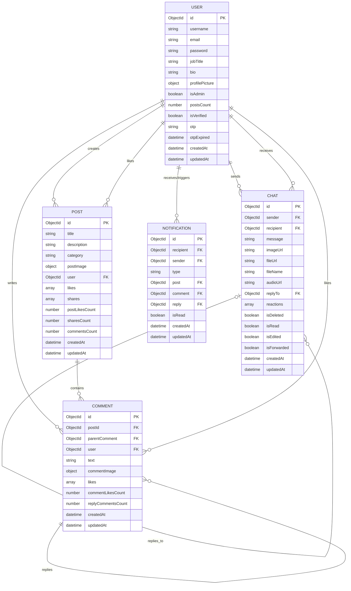

# Fluxion API

A robust, enterprise-grade RESTful API built for the **Fluxion** social media and engineering platform. Built with **Node.js**, **Express.js**, and **MongoDB (Mongoose)**, fully typed in **TypeScript**.

Includes JSON Web Token (JWT) authentication, role-based authorization, rate limiting, Zod schema validation, Cloudinary media processing, Nodemailer OTP delivery, nested comment/reply architecture, and Swagger documentation (`/api-docs`).

---

## 🛠️ Tech Stack & Dependencies

- **Runtime:** Node.js (v18+)
- **Framework:** Express.js (v5)
- **Language:** TypeScript (ESM)
- **Database:** MongoDB via Mongoose ODM
- **Validation:** Zod
- **Security:** Bcrypt.js, Helmet, CORS, Express-Rate-Limit (`authLimiter`, `apiLimiter`)
- **Media Uploads:** Multer with Cloudinary API
- **Mail Delivery:** Nodemailer (Registration OTP and Password Reset)

---

## ✨ Core API Capabilities

### 🔐 1. Authentication & Security

- **Dual-Token Authentication Architecture**: Short-lived access token (15m) returned on login/register + 7-day refresh token stored in secure `httpOnly`, `sameSite: strict` cookie.
- **Token Rotation & Refresh (`/auth/refresh-token`)**: Validates incoming `refreshToken` cookie against DB (`user.refreshToken`) and issues a new access token.
- **Server-Side Session Invalidation (`/auth/logout`)**: Unsets refresh token from DB and clears the `httpOnly` cookie.
- **OTP Registration & Email Verification**: Users register and receive a 6-digit OTP via email (`/auth/register`), verified against DB expiration (`/auth/verify-otp`).
- **Rate-Limited Endpoints**: Login (`authLimiter`: 10 req/min) and API endpoints (`apiLimiter`: 100 req/15min).
- **Password Reset Pipeline**: Forgot password (`/auth/forgot-password`) sends signed reset links via Nodemailer.
- **Middlewares**: `verifyToken`, `verifyRefreshToken`, `verifyAuthorizedToken`, `verifyAdminToken`, `verifySuperAdminToken`.

### 📝 2. Posts & Atomic Image Management

- **Single Atomic Multipart Requests**: Post creation (`POST /posts`) and updates (`PUT /posts/:postId`) handle text and `postImage` in a single `Multipart/FormData` request.
- **Deep User Populates**: Populates `user`, `likes`, `shares` with selected fields (`_id`, `username`, `profilePicture`, `jobTitle`, `bio`).
- **Social Features**: Like/unlike toggle, post sharing with `sharesCount` tracking.

### 💬 3. Comments & Nested Inline Replies

- **Comments (`/posts/:postId/comments`)**: Create, update, delete, and like comments with optional `commentImage` attachments.
- **Inline Replies (`/posts/:postId/comments/:commentId/replies`)**: Full CRUD and like pipeline for replies supporting `replyImage` attachments.

### 👤 4. User Profiles

- **Profile Details**: Supports `username` (up to 50 chars), `jobTitle` (up to 50 chars), `bio` (up to 250 chars), and profile picture uploads.
- **Cloudinary Cleanup**: Legacy Cloudinary images are automatically deleted when updated or removed.

### 🔔 5. Real-Time & Event Notifications

- **Notifications (`/notifications`)**: Retrieve user notifications with populated sender info, mark all notifications as read, or mark individual notifications as read.
- **Activity Triggers**: Supports notifications for follow, comment, like, share, reply, comment like, and reply like events.

### 💬 6. Direct Chat & Messaging

- **Conversation Inbox (`/chat/conversations`)**: Lists the latest message and unread count for each conversation.
- **Text and File Messages (`/chat/:recipientId/send`)**: Sends text with optional image or non-image file attachments (up to 100 MiB).
- **Voice Messages (`/chat/:recipientId/audio`)**: Uploads audio messages and supports replies to existing messages.
- **Replies and Forwards**: Reply to a message with text or a file, and forward existing text, media, or voice messages.
- **Message Controls**: Edit and soft-delete sent messages; add, change, or remove reactions.
- **Read State**: Fetching a conversation marks incoming messages as read; an explicit mark-as-read endpoint is also available.

---

## 📊 Database Entity-Relationship (ER) Diagram



---

## 🚦 Environment Setup

Create a `.env` file in the `backend/` directory:

```env
PORT=5000
MONGO_URI=mongodb://localhost:27017/fluxion
JWT_SECRET_KEY=your_secret_key
JWT_REFRESH_KEY=your_refresh_secret_key
FRONTEND_URL=http://localhost:3000

# Cloudinary
CLOUDINARY_CLOUD_NAME=your_cloud_name
CLOUDINARY_API_KEY=your_api_key
CLOUDINARY_API_SECRET=your_api_secret

# Nodemailer
APP_EMAIL_ADDRESS=your_email@gmail.com
APP_EMAIL_PASSWORD=your_app_password
```

### Running Commands

```bash
# Install dependencies
npm install

# Start development server with live reload
npm run dev

# Build TypeScript to dist
npm run build
```

---

## 📖 API Documentation

Interactive Swagger API docs available at:
`http://localhost:5000/api-docs`

Full Markdown documentation available in [API-Docs.md](API-Docs.md).
